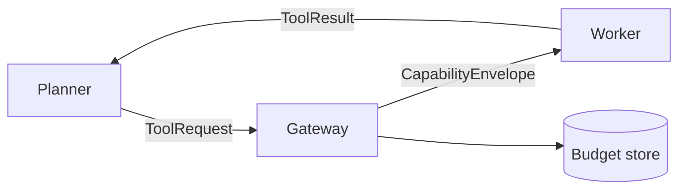

# Distributed: one policy across processes and machines

Single-process `safely(...)` is enough for one agent in one Python process.
When the planner, tool workers, and model calls live in **different processes**
(or languages), you still want one shared budget, one audit trail, and the same
least-privilege guarantees — without a gateway round-trip on every tool call.

Everything on this page lives in `agent_safety.distributed`:

```python
from agent_safety.distributed import (
    DistributedConfig, PolicySpec, RunContext, CapabilityEnvelope,
    MemoryBackend, MemoryNonceStore,
)
```

## The two-tier model

| Tier | Where | What happens |
|---|---|---|
| **Cold path** | Policy Gateway (PDP) | Authoritative mint/charge/audit over HTTP; atomically updates the shared budget store |
| **Hot path** | Tool worker | Verify a signed `CapabilityEnvelope` locally (~µs); run the tool under `safely(envelope=...)` |



```bash
pip install agent-safety[distributed]   # adds redis>=4.0 for a shared budget store
```

## Building blocks

The same ideas as the single-process API, just serializable and shareable:

* **`PolicySpec`** — the complete, versioned, hashable form of a `safely` block
  (every declarative keyword; JSON schema at
  [`schemas/policy_spec.schema.json`](../schemas/policy_spec.schema.json)).
  Publish it to a gateway registry or embed it in events;
  `safely_from_spec(spec)` replays it.
* **`RunContext`** — `task_id` / `request_id` / `agent_id` / `org_id`
  correlation IDs, stamped on every audit event and used for idempotent budget
  charges.
* **`CapabilityEnvelope`** — a short-lived, signed proof that *this* capability
  was minted against *this* policy hash. Workers verify locally with
  `envelope_keys=` (HMAC) — no per-call gateway hop.
* **`BudgetBackend`** — a shared budget store (memory, Redis, SQL, Mongo,
  Dynamo) so parallel workers draw down one budget.
* **`NonceStore`** — a shared spent-nonce store so a replayed envelope fails on
  *every* worker.

```python
from agent_safety import safely, tool
from agent_safety.distributed import PolicySpec, RunContext
from agent_safety.distributed.gateway.client import GatewayClient

spec = PolicySpec(allow=("search",), calls=10, no_repeats=3)
ctx = RunContext.new(agent_id="planner")

# Cold path: mint an envelope (charges the shared budget once)
client = GatewayClient("http://gateway:8765")
envelope = client.fetch_envelope({
    "task_id": ctx.task_id,
    "request_id": ctx.request_id,
    "capability": "search",
    "policy_spec": spec.to_dict(),
})

# Hot path: verify locally, then run the tool under the same pipeline
with safely(envelope=envelope, envelope_keys={"default": signing_secret}, run=ctx):
    search("query")
```

Start the gateway (a stdlib HTTP PDP — put mTLS and a hardened front door in
front of it in production):

```bash
python -m agent_safety.distributed.gateway --port 8765
# GET  /healthz /readyz /metrics /v1/keys   (fingerprints only)
# POST /v1/mint /v1/charge /v1/audit
```

## Configuration: one explicit object

All distributed behavior is driven by a single `DistributedConfig`; environment
variables are a fallback, not the API:

```python
from agent_safety.distributed import DistributedConfig, DistributedMode

cfg = DistributedConfig(
    mode=DistributedMode.ENFORCE,          # local / shadow / canary / enforce
    canary_percent=10,
    gateway_url="http://gateway:8765",
    signing_keys={"default": secret},
    redis_url="redis://cache:6379/0",
    org_id="acme",
)
with safely(allow="search", distributed=cfg, envelope=env, run=ctx):
    ...

cfg = DistributedConfig.from_env()         # or read AGENT_SAFETY_* env vars once
```

### Rollout modes

| Mode | Behavior |
|---|---|
| `local` (default) | no envelope requirement |
| `shadow` | if an envelope is present, verify it; on failure log and continue |
| `canary` | require a valid envelope for a hash-fraction of `task_id`s (`canary_percent`, default 10) |
| `enforce` | every `safely(...)` without a valid envelope fails closed |

Env-var equivalents: `AGENT_SAFETY_DISTRIBUTED`, `AGENT_SAFETY_CANARY_PERCENT`,
`AGENT_SAFETY_GATEWAY_URL`, `AGENT_SAFETY_SIGNING_KEYS`,
`AGENT_SAFETY_REDIS_URL`, `AGENT_SAFETY_ORG_ID`.

## Three patterns

### 1. Event-driven loop (reactive)

Planner and workers are separate processes connected by a queue, bus, or
webhook. Planner emits a `ToolRequest` → worker mints via `/v1/mint` → worker
runs the tool inside `safely(envelope=...)` → worker emits a `ToolResult`.
Runnable demo: [`examples/distributed_event_loop.py`](../examples/distributed_event_loop.py).

### 2. Supervisor handoff (narrow on delegate)

A supervisor delegates a subtask to a worker that should have **fewer** powers.
`parent.narrow(child_spec)` derives a strictly tighter spec; the envelope is
minted against the narrowed hash, so worker B can `summarize` but cannot
`search` — even if compromised.

```python
parent = PolicySpec(allow=("search", "summarize"), calls=10)
child = parent.narrow(PolicySpec(allow=("summarize",), calls=3))
```

Runnable demo: [`examples/distributed_handoff.py`](../examples/distributed_handoff.py).

### 3. Parallel branches, one budget

Several workers (threads, pods, asyncio tasks) share one task's budget via a
common `BudgetBackend` and the same `task_id`; each charge carries a unique
`request_id`, so retries are idempotent. With `calls=3`, the 4th parallel call
anywhere raises `QuotaExceeded`. Runnable demo:
[`examples/distributed_parallel_branches.py`](../examples/distributed_parallel_branches.py).

```python
with safely(allow="search", calls=3, backend=backend, run=RunContext.new()):
    search("q")     # charges the shared store, not a process-local quota
```

## Bring your own database

The library never hosts a database. Pass a client or DB-API connection factory
to a store you already operate; budgets and nonces share the same plugin shape
(`BudgetBackend` / `NonceStore`).

| Store | Budget backend | Nonce store | Install |
|---|---|---|---|
| Memory (default) | `MemoryBackend` | `MemoryNonceStore` | — |
| Redis | `RedisBudgetBackend` | `RedisNonceStore` | `agent-safety[distributed]` |
| SQL (SQLite / Postgres / MySQL) | `SqlBudgetBackend` | `SqlNonceStore` | stdlib `sqlite3` or your driver |
| MongoDB | `MongoBudgetBackend` | `MongoNonceStore` | `agent-safety[mongo]` |
| DynamoDB | `DynamoBudgetBackend` | `DynamoNonceStore` | `agent-safety[dynamodb]` |

`pip install agent-safety[stores]` pulls all three drivers at once.

```python
import sqlite3
from agent_safety.distributed.backends.sql_backend import SqlBudgetBackend
from agent_safety.distributed.nonces import SqlNonceStore

backend = SqlBudgetBackend(lambda: sqlite3.connect("budgets.db"))
backend.ensure_schema()
```

Wire-compatible stores work through the matching plugin: Valkey / KeyDB via the
Redis backend; MariaDB via `dialect="mysql"`; CockroachDB / Neon / Supabase /
RDS via `dialect="postgres"`; Turso / D1 via `dialect="sqlite"`; DocumentDB /
Cosmos-Mongo via the Mongo backend. Anything else: implement the two small
protocols (`charge()` + `release_concurrency()`; `spend(nonce, expires_at)`)
and pass them in.

**Atomicity:** Redis (Lua) and SQL (row locks) are strongest for many-process
workers; Mongo and Dynamo use a process lock plus conditional writes — fine for
typical pools. A plain `sqlite3.connect(":memory:")` is a fresh DB per
connection and will not share state.

## Production

Env-var reference, key rotation, Prometheus metrics, hash-chained audit, K8s
manifests, and runbooks: [OPERATIONS.md](../OPERATIONS.md). Trust boundaries and
residual risks: [THREAT_MODEL.md](../THREAT_MODEL.md).
